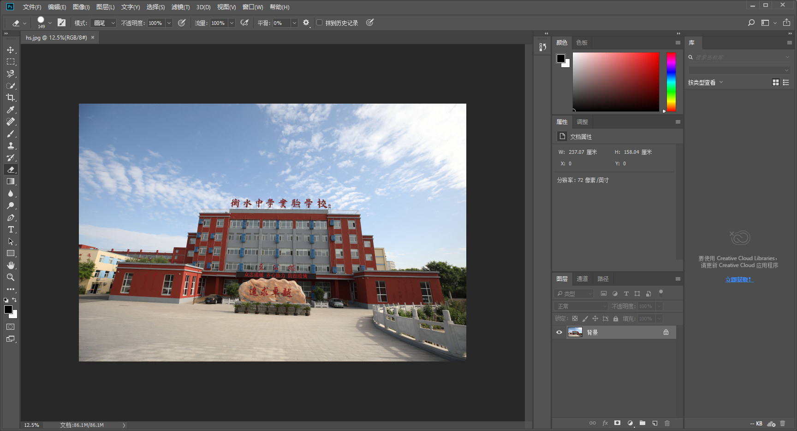
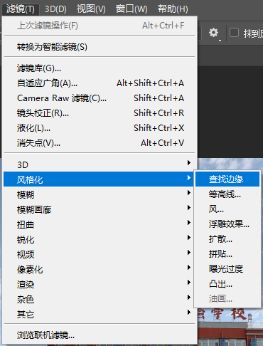
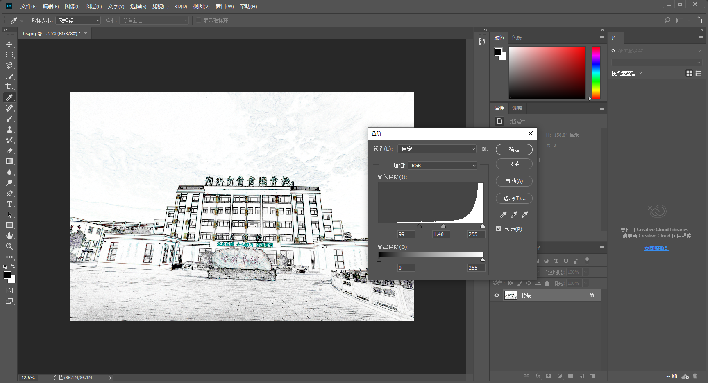
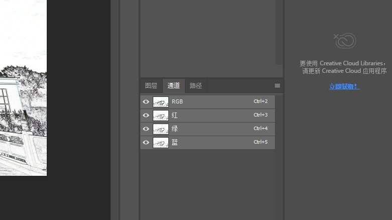
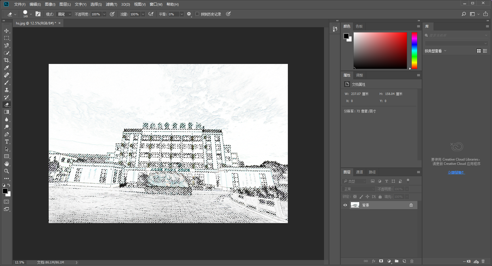
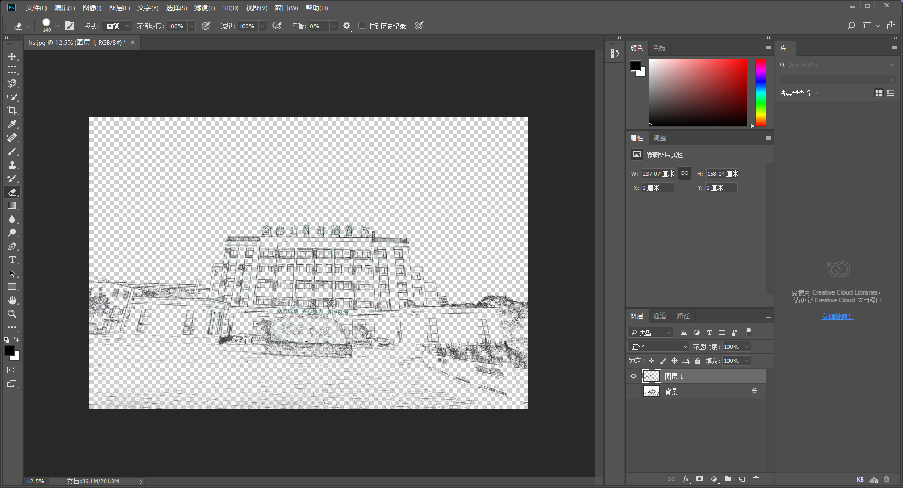

这篇博文旨在快速提取照片图形边缘，以快速将其转换为线描画。

## 准备工具
Adobe Photoshop

## 操作流程
首先将待操作的图片用 Photoshop 打开。  

在“滤镜”选项卡中找“风格化” -> “查找边缘”。  

按下 `Ctrl + L` 键适当调整色阶，突出想要保留的边缘。  

在右侧“通道”选项卡中，按住 `Ctrl` 左键点击“RGB 通道”，选中该通道路径。  

回到“图形”选项卡，按 `Ctrl + Shift + I` 反选路径，按 `Ctrl + J` 粘贴为图层。  

然后删除或者隐藏原图图层即可。
